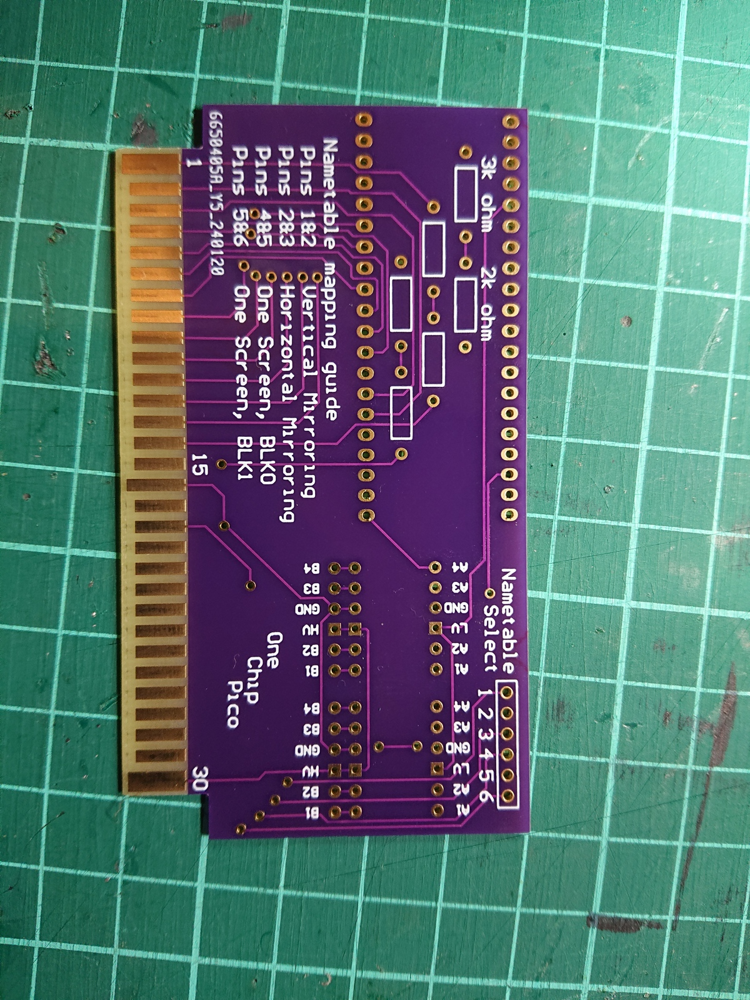
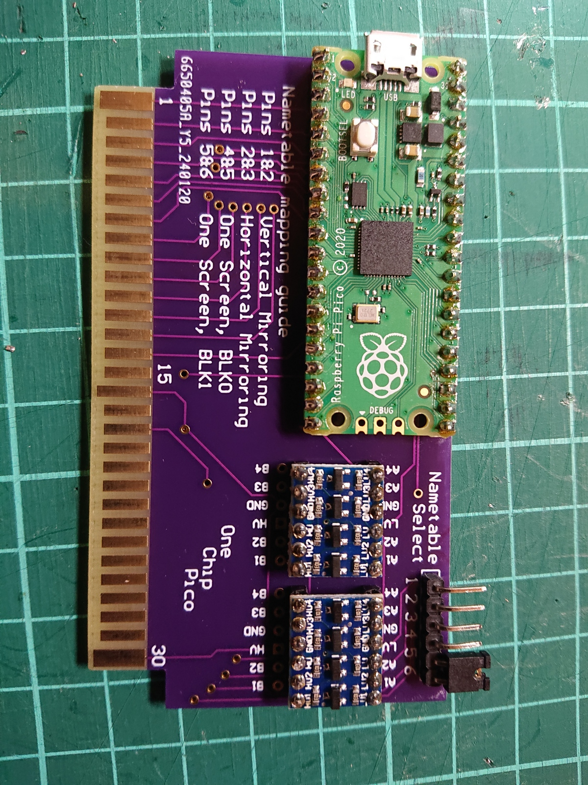
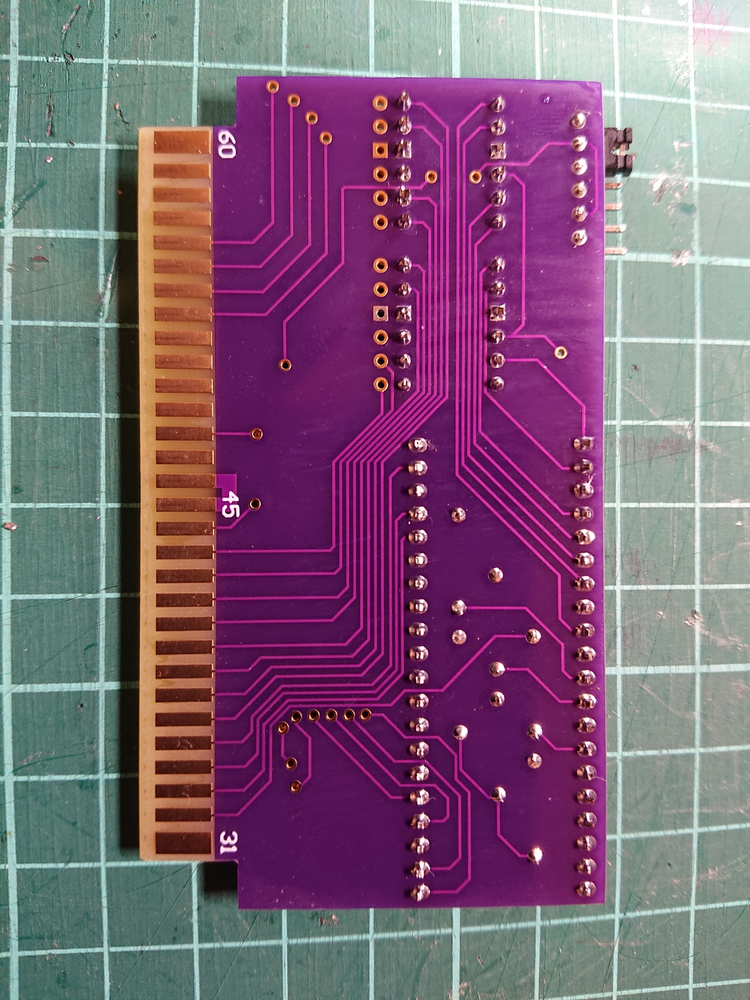

# one_chip_pico
A Famicom cartridge running on a Raspberry Pi Pico

The v2 (main) cart has address pins from GPIO pins 0 - 14 on the Pico, data pins from 15 - 22 with the ROMSEL on pin 26.

This is the program driving the custom cartridge seen in https://forums.nesdev.org/viewtopic.php?p=287730&sid=39f16afe21ae319c02cf7025c29bdbed#p287730

It is heavily derived from the PicoCart64 project.

nes2h.py is used to convert your PRG .nes file to the prg_data.h file used to compile the PRG data into the program. This could be improved.

As this is a PRG only solution, with no CHR-ROM present and using half the nametable RAM as CHR-RAM, no official titles will run on it. A few homebrew games will run, like MagicFloor. This is for running custom code.


### Custom PCB Option
A custom fabrication PCB option is now available. This PCB is designed to support the v2+writes version of the one_chip_pico but will also work with the v2 version builds. If making a board that will only support this version of the project, only the bottom voltage divider needs to be populated. I would recommend fully populating the board, though.

Color choice is up to you (green and purple were the same price at the time) and here are the specifications used
```
2 layers
1.2mm PCB thickness
Tented vias (no difference?)
ENIG Surface Finish (the most expensive option but definitely the best looking)
Gold Fingers 1U" (for the cartridge connector)
30 degree chamfered (for the cartridge connector)
```
Has pins to support the SparkFun Logic Level Converter boards and the cheaper batch LLC boards you can get on Aliexpress or Amazon. 2k/3k resistors are marked, but 2.2k/3.3k can also be used (aiming for the 3V sweet spot from a 5V source). Nametable select can be done with pins and a jumper, or soldering bridge between the pads.



