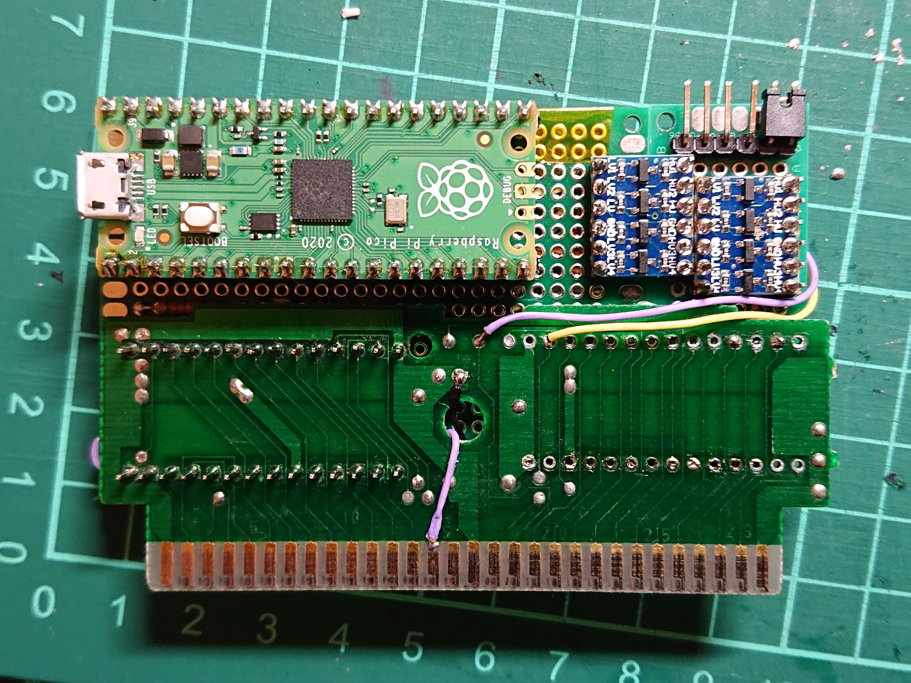
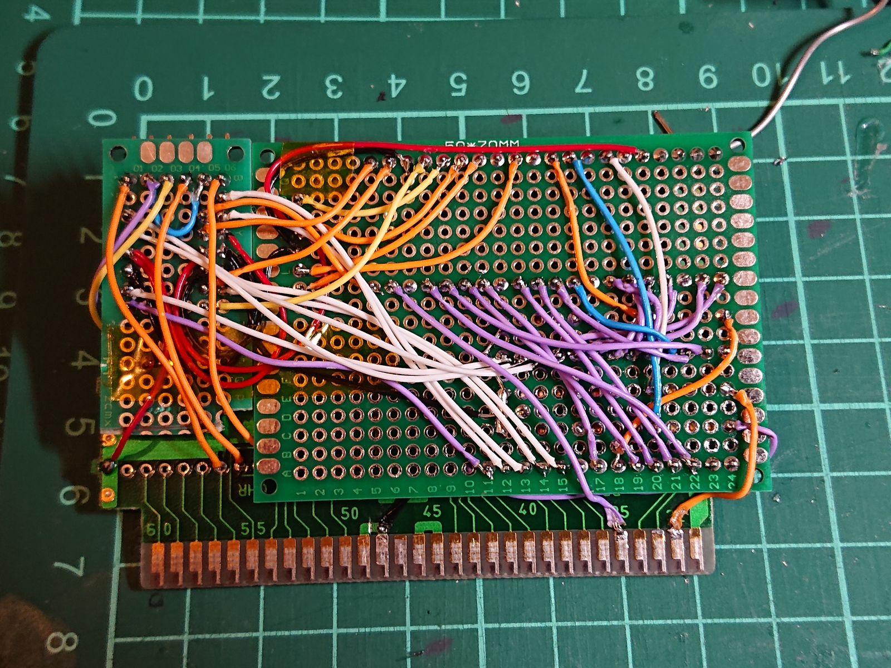

# one_chip_pico
A Famicom cartridge running on a Raspberry Pi Pico

The v2+writes cart has address pins from GPIO pins 0 - 14 on the Pico, data pins from 15 - 22 with the ROMSEL on pin 26, the CPU R/W on pin 27 and the M2 signal on pin 28. This cart is compatible with the v2 builds, but prg_data.h files generated with the const tag won't compile with this build (just remove the const).

ROMSEL, R/W and M2 are all connected through a voltage divider to protect the ADC GPIO pins from higher than ideal voltages (tighter voltage targets might improve stability)

This is the program driving the custom cartridge seen in https://forums.nesdev.org/viewtopic.php?p=287730&sid=39f16afe21ae319c02cf7025c29bdbed#p287730

It is heavily derived from the PicoCart64 project.

nes2h.py is used to convert your PRG .nes file to the prg_data.h file used to compile the PRG data into the program. This could be improved.

As this is a PRG only solution, with no CHR-ROM present and using half the nametable RAM as CHR-RAM, no official titles will run on it. A few homebrew games will run, like MagicFloor. This is for running custom code.

